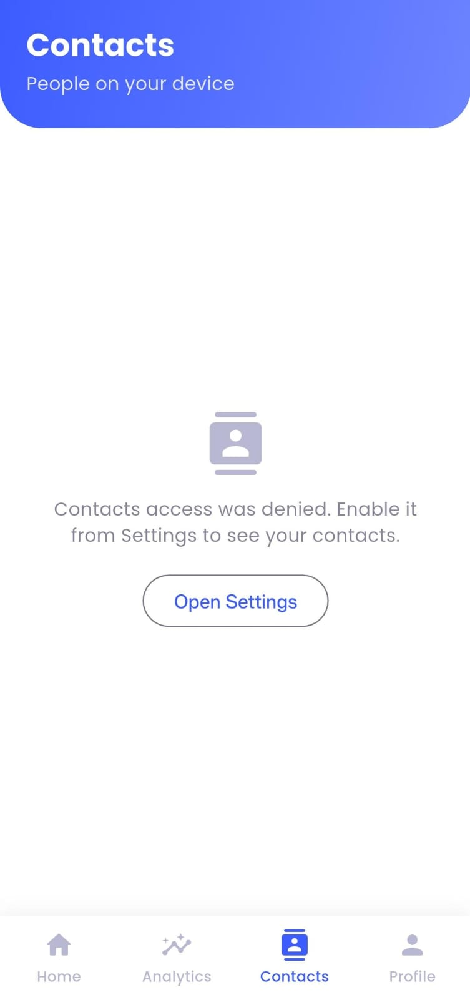
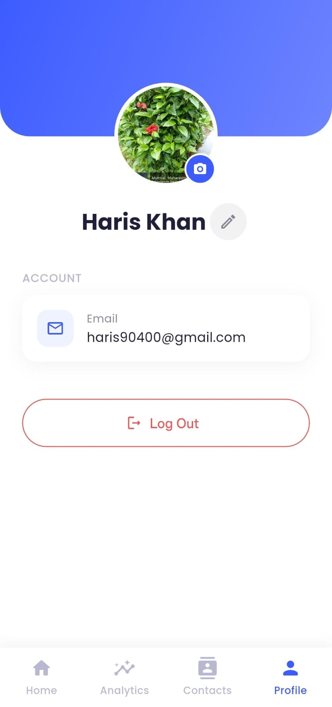
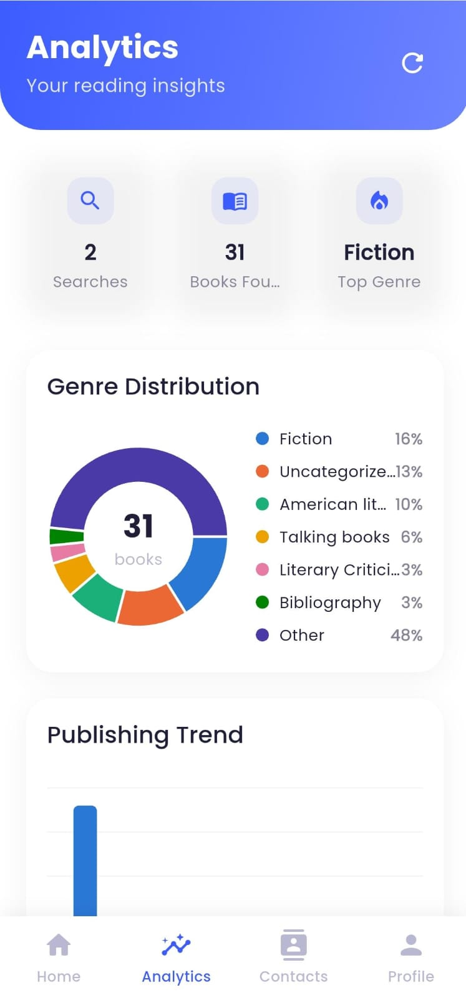
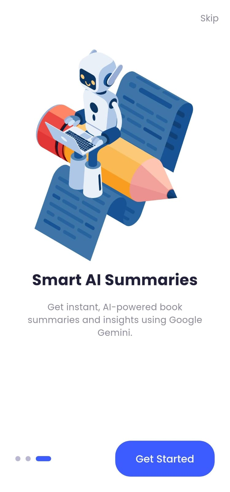
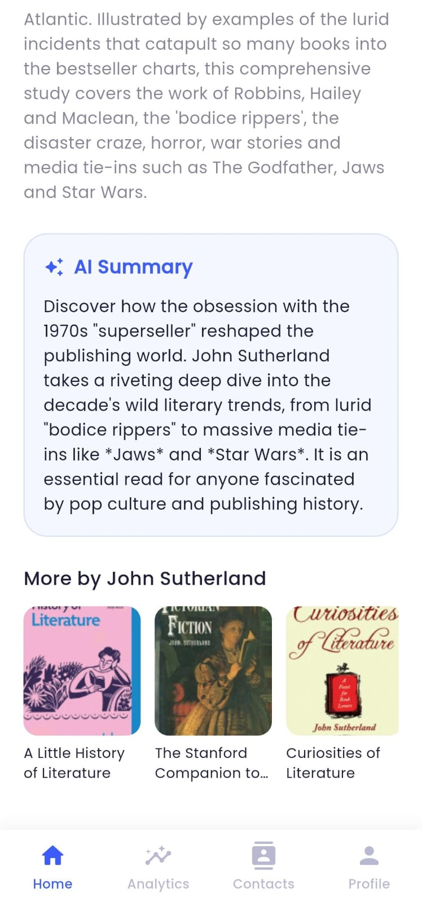

# Books Discovery App

A modern, cross-platform Flutter application built to demonstrate expertise in state management, authentication, advanced device features, real-time communication, and AI integrations.

## 📸 Screenshots

|                  Home (Search)                  |                      Analytics                       |                      Contacts                       |                      Profile                       |
| :---------------------------------------------: | :--------------------------------------------------: | :-------------------------------------------------: | :------------------------------------------------: |
|  |  |  |  |

_(Additional flow screenshots)_
| Onboarding | Smart AI Summaries |
|:---:|:---:|
|  |  |

---

## 🔍 Multi-Modal Search Mechanisms

This app goes beyond standard text input by offering a deeply integrated **multi-modal search experience** using the device camera.

- **Text Search:** Standard query-based search that debounces user input and queries the Google Books API.
- **QR Code & Barcode Search:** Utilizes the `mobile_scanner` package to instantly read ISBN barcodes from physical books or QR codes containing book links/titles. The extracted data is automatically populated into the search pipeline.
- **OCR (Text Recognition):** Utilizes `google_mlkit_text_recognition`. Users can take a photo of a physical book cover, and the app extracts the title/author text on-device using Machine Learning, feeding it directly into the search bar.

## 📊 Analytics Logic (Local Data → Insights)

The Analytics module tracks user reading and search habits using a local-first approach:

- **Local Caching:** Every time a user searches for a book, the results are cached locally using `Hive` (NoSQL).
- **Data Aggregation:** The `AnalyticsBloc` reads this historical data and aggregates it to generate insights. For example, it extracts the `categories` (Genres) from the cached books to compute a distribution for the **Genre Donut Chart**, and extracts `publishedDate` to plot a **Publishing Trend Line Chart**.
- **Privacy-First:** Since the aggregation happens entirely on the client side using Hive, user reading habits are kept completely private.

## ⚡ WebSocket Integration (Real-time Trends)

To demonstrate real-time communication, the app features a **Live Trending Books** ticker on the Analytics tab.

- The app establishes a persistent `StreamSubscription` to a WebSocket server (`wss://echo.websocket.events/` used as a mock data stream for the assessment).
- The `TrendingBooksCubit` listens to this stream, parses the incoming socket events into `Book` entities, and emits real-time state updates.
- If the connection is lost, the app automatically attempts to reconnect with an exponential backoff strategy, ensuring a resilient UI.

## 🧠 Google Gemini Integration

The app leverages Google's Generative AI (Gemini) to provide "Smart Insights" on the Book Details screen.

- Instead of just showing the standard publisher description, the app sends the book's metadata (Title, Author, Description) to the **Gemini 1.5 Flash** model.
- Gemini generates a structured, human-readable summary (e.g., "Why you should read this," "Key Themes," "Tone"), providing a rich, augmented reality-like reading experience for the user.

## 🔥 Firebase Setup

The app uses Firebase for robust Email/Password authentication and Google Sign-In.
**Note:** For security reasons, the `google-services.json` and `GoogleService-Info.plist` files are **not** included in this repository.

To run this app locally with Firebase:

1. Create a new Firebase project in the [Firebase Console](https://console.firebase.google.com/).
2. Enable **Authentication** (Email/Password & Google providers).
3. Register your Android app and download `google-services.json` into `android/app/`.
4. Register your iOS app and download `GoogleService-Info.plist` into `ios/Runner/`.
5. Ensure your `SHA-1` and `SHA-256` keys are added to the Firebase console for Google Sign-In to function properly.

## 🚀 Getting Started

1. **Install Dependencies:**
   ```bash
   flutter pub get
   ```
2. **Environment Variables:**
   Create a `.env` file in the root directory and add your Google Gemini API key:
   ```env
   GEMINI_API_KEY=your_actual_api_key_here
   GOOGLE_BOOKS_API_KEY=your_actual_api_key_here
   ```
3. **Run Code Generation (AutoRoute & GetIt):**
   ```bash
   dart run build_runner build --delete-conflicting-outputs
   ```
4. **Run the App:**
   ```bash
   flutter run
   ```
